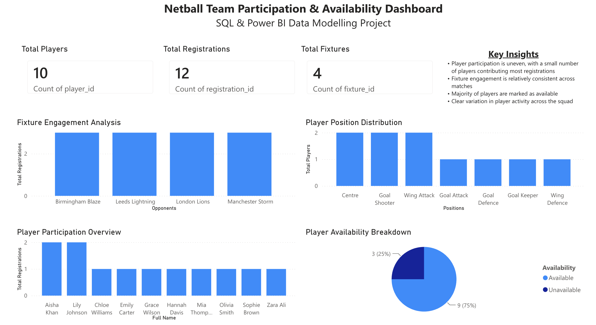
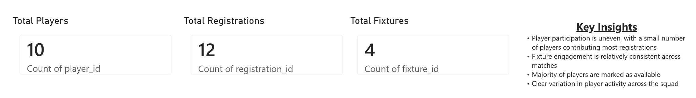
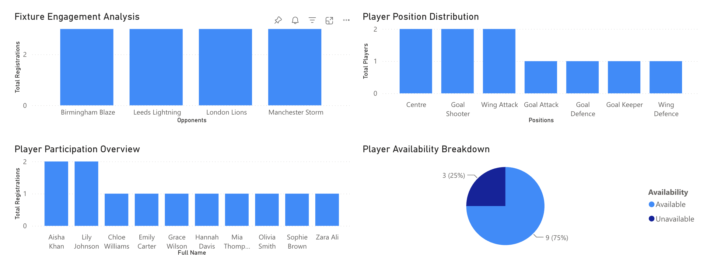

# Netball Team Analytics Dashboard (SQL + Power BI)

## Project Overview

This project is a Netball Team Analytics Dashboard built using SQL and Power BI. It analyses player participation, fixture engagement, registrations, positions, and availability to provide insights into team activity and squad management.

The project demonstrates an end-to-end data analysis workflow including SQL querying, data modelling, and interactive dashboard development.

---

## Tools Used

* MySQL and DBeaver(data extraction and aggregation)
* Visual Studio Code
* Power BI (dashboard creation and visualisation)
* Excel / CSV (data import and storage)

---

## Dataset Structure

The dashboard was created using three related datasets:

### Players

Contains player information including:

* Player ID
* Full Name
* Position
* Email

### Fixtures

Contains match information:

* Fixture ID
* Opponent
* Fixture Date
* Location

### Registrations

Contains player registrations and participation records:

* Registration ID
* Player ID
* Fixture ID
* Availability status

---

## Data Processing (SQL)

SQL was used to structure and analyse the data before visualisation.

Queries included:

* Counting total players
* Counting registrations
* Counting fixtures
* Player participation analysis
* Fixture engagement analysis
* Position distribution analysis
* Availability breakdown

---

## Dashboard Features

### KPI Cards

* Total Players
* Total Registrations
* Total Fixtures

### Visualisations

* Player Participation Overview
* Fixture Engagement Analysis
* Player Position Distribution
* Player Availability Breakdown

---

## Key Insights

* Player participation varied across the squad, with some players registering more frequently than others
* Fixture engagement remained relatively balanced across opponents
* Most players were marked as available for participation
* Position distribution provided visibility into squad composition

---

## Project Objective

The objective of this project was to transform raw netball data into an interactive dashboard that supports analysis of participation, fixture activity, and player availability.

---

## Dashboard Preview

### Full Dashboard View

### KPI Overview

### Chart Highlights

---

## Skills Demonstrated

* SQL querying and aggregation
* Relational data modelling
* Power BI dashboard development
* Data visualisation
* Insight generation
* Analytical thinking

---

## Conclusion

This project demonstrates how SQL and Power BI can be combined to transform raw netball data into clear, visual insights for reporting and decision-making.
